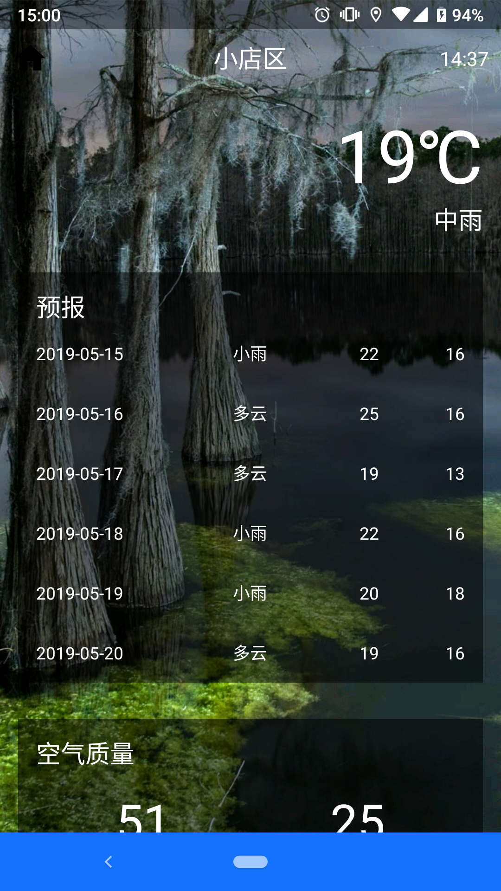
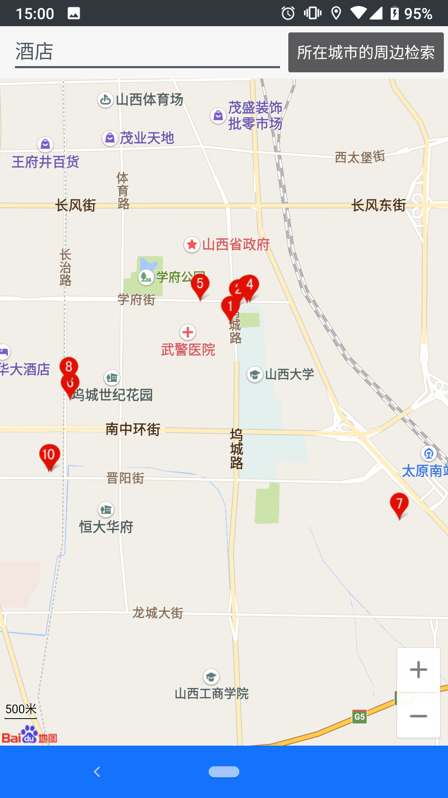
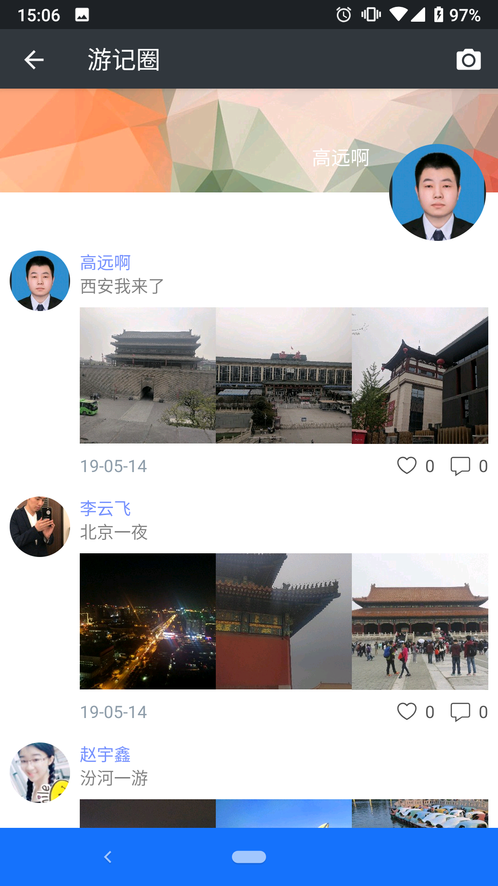
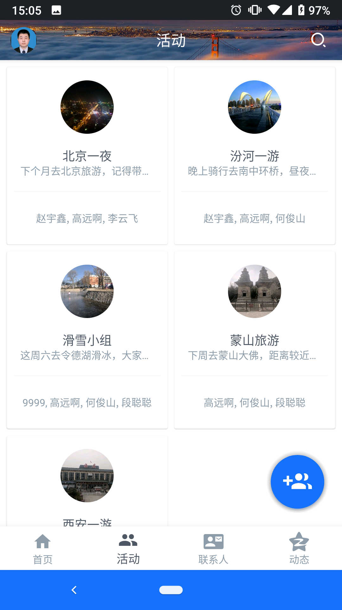
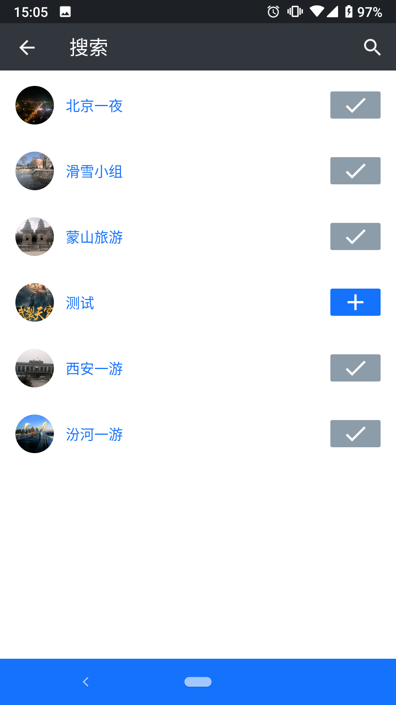
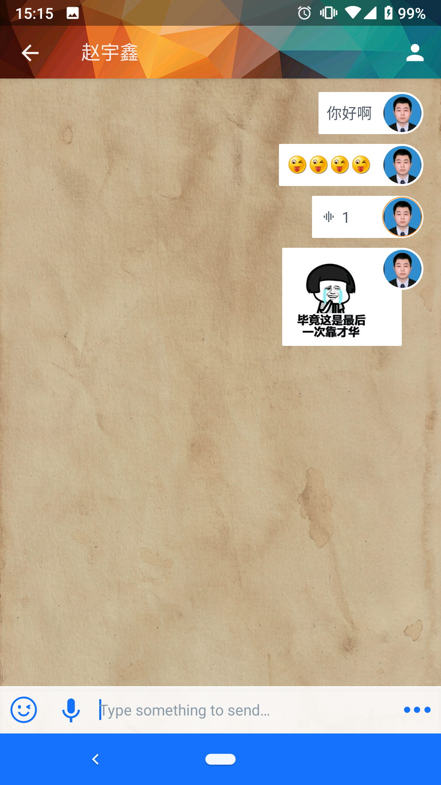
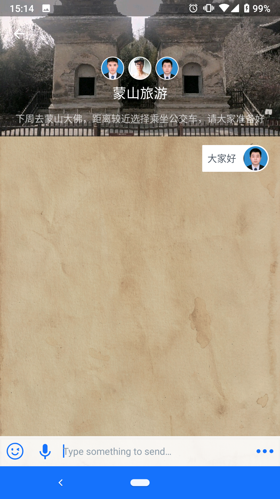

# 基于Android的旅游社交App的设计与实现
---
## 毕业设计程序源码 
Android App文件夹为客户端源码  
Web文件夹为服务端源码

## 开发环境
Android Studio 2.4 第六次预览版  
IDEA 2018.3.2版本  
JDK 1.8  
compileSdkVersion 25  
buildToolsVersion "25.0.2"  
classpath 'com.android.tools.build:gradle:2.3.2'  
个推及阿里云存储都为个人拥有，key不保证一直能用  
服务端代码已部署到腾讯云服务器上，接口为http://139.199.20.26:8080/iTalker-1.0-SNAPSHOT/api/，  2019年6月到期  
## 运行截图  
来自论文（标号没改）  
  
  
5.2.1.	APP载入界面：点击驴友社交APP图标，进入安卓APP的加载界面，载入界面暂停2秒自动跳到主页，也可在加载页面植入广告。载入界面如图5-1所示。   
  
      
        图 5-1 客户端载入界面                
5.2.2.	个人信息  
  
  
（1）注册：用户将个人信息填入就可以注册，填完手机号后需要上传头像。（如图5-2所示）  
（2） 登录：如果已有账号，将个人信息输入完成登录，如果没有账号，需要返回上一步注册。（如图5-3所示）  
        
   图 5-2 客户端注册界面                      图 5-3  客户端登录界面  
（3）个人信息界面（从标题栏左侧进入或从聊天界面进入）：如图5-4所示  
      
  图 5-4  个人信息界面  
5.2.3.	APP首页的旅游信息页面：如图5-5到5-8所示  
       
   图 5-5 客户端主页			图 5-6 天气页面  
      

图 5-7 附近关键词搜索结果页面       图 5-8 精选文章页面  

5.2.4.	好友界面  
（1）	所有好友的列表，点击相应的好友可以跳转到聊天界面进行聊天：如图5-9所示  
（2）	搜索并添加好友的界面，关注后即时显示在好友列表中：如图5-10所示  
    

图 5-9  好友列表                        图 5-10  搜索好友的列表  

5.2.5.	游记圈界面（左图为所有游记列表界面，右图为添加游记界面）  
     

 图 5-11  游记动态界面              图 5-12  添加游记界面  
 
5.2.6.	群组界面  
       

图 5-13  群组列表界面                     图 5-14  添加群组界面   
      
  
  
图 5-15  搜索群组界面                        图 5-16  添加群成员界面  

5.2.7.	聊天界面  

（1）	单人聊天的界面，包括文字聊天、表情聊天、图片发送、语言聊天：如图5-17所示  
（2）	活动群组聊天的界面，包括文字聊天、表情聊天、图片发送、语言聊天：如图5-18所示  
      

图 5-17  单人聊天界面               图 5-18  群组聊天界面
